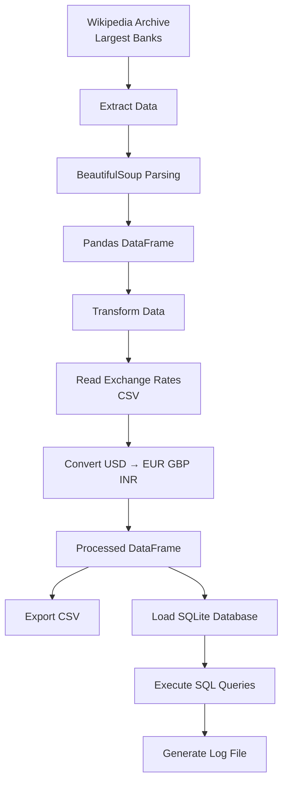

# ETL Pipeline - Largest Banks by Market Capitalization

## Overview

This project implements a complete **Extract, Transform, Load (ETL)** pipeline using Python.

The pipeline extracts information about the world's largest banks from an archived Wikipedia webpage, transforms market capitalization values into multiple currencies using exchange rate data from a CSV file, stores the processed data in both CSV and SQLite formats, and executes SQL queries to validate the results.

This project was developed as part of the **IBM Data Engineering Professional Certificate**.

---

## ETL Architecture



---

## Features

- Web scraping using BeautifulSoup
- HTTP request handling using Requests
- Data cleaning and preprocessing
- Currency conversion using exchange rates
- CSV export
- SQLite database integration
- SQL query execution
- ETL execution logging
- Modular and reusable Python functions

---

## Technologies Used

| Technology | Purpose |
|------------|---------|
| Python | Programming Language |
| Requests | Retrieve webpage data |
| BeautifulSoup | HTML parsing |
| Pandas | Data manipulation |
| NumPy | Numerical operations |
| SQLite3 | Database storage |
| Datetime | Logging timestamps |

---

## Repository Structure

```
etl-largest-banks/
│
├── final_project.py          # Main ETL pipeline
├── exchange_rate.csv         # Input exchange rates
├── README.md                 # Project documentation
├── requirements.txt          # Python dependencies
├── .gitignore                # Ignore generated files
├── LICENSE                   # MIT License
│
├── screenshots/
│   ├── dataframe_output.png
│   ├── sqlite_query.png
│
└── images/
    └── etl_pipeline.png
```

---

## ETL Workflow

### 1. Extract

The pipeline retrieves an archived Wikipedia page containing the market capitalization of the world's largest banks and extracts:

- Bank Name
- Market Capitalization (USD)

---

### 2. Transform

Market capitalization values are converted from USD into:

- Euro (EUR)
- British Pound (GBP)
- Indian Rupee (INR)

using exchange rates stored in a CSV file.

---

### 3. Load

The transformed dataset is exported to:

- CSV file
- SQLite database

---

### 4. Query

Several SQL queries are executed to validate the stored data.

Example queries include:

```sql
SELECT *
FROM Largest_banks;
```

```sql
SELECT AVG(MC_GBP_Billion)
FROM Largest_banks;
```

```sql
SELECT Name
FROM Largest_banks
LIMIT 5;
```

---

### 5. Logging

The pipeline records execution progress into a log file, including timestamps for every ETL stage.

---

## Example Output

| Bank Name | USD | EUR | GBP | INR |
|-----------|----:|----:|----:|----:|
| JPMorgan Chase | 432.92 | 398.29 | 346.34 | 35942.82 |
| Bank of America | ... | ... | ... | ... |

---

## Learning Objectives

This project demonstrates practical experience with:

- ETL pipeline development
- Web scraping
- Data cleaning
- Data transformation
- SQL databases
- Python programming
- Data Engineering fundamentals

---

## Future Improvements

Potential enhancements include:

- Retrieve live exchange rates through an API
- Add exception handling and retry logic
- Create automated unit tests
- Containerize the project using Docker
- Schedule ETL execution with Apache Airflow
- Store processed data in PostgreSQL
- Deploy the pipeline in a cloud environment

---

## Author

**Santiago Burgos**

Electronics Engineer, passionate about building scalable data pipelines and cloud-based data solutions.

---

## License

This project is intended for educational and portfolio purposes.
