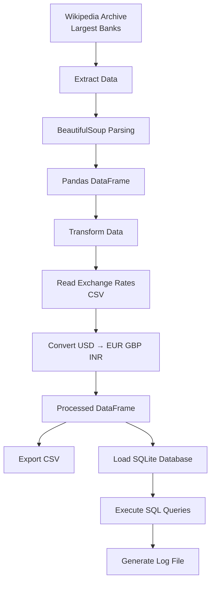

## ETL Architecture

```mermaid
flowchart TD

    A[Wikipedia Archive<br>Largest Banks] --> B[Extract Data]

    B --> C[BeautifulSoup Parsing]

    C --> D[Pandas DataFrame]

    D --> E[Transform Data]

    E --> F[Read Exchange Rates<br>CSV]

    F --> G[Convert USD → EUR GBP INR]

    G --> H[Processed DataFrame]

    H --> I[Export CSV]

    H --> J[Load SQLite Database]

    J --> K[Execute SQL Queries]

    K --> L[Generate Log File]
```
